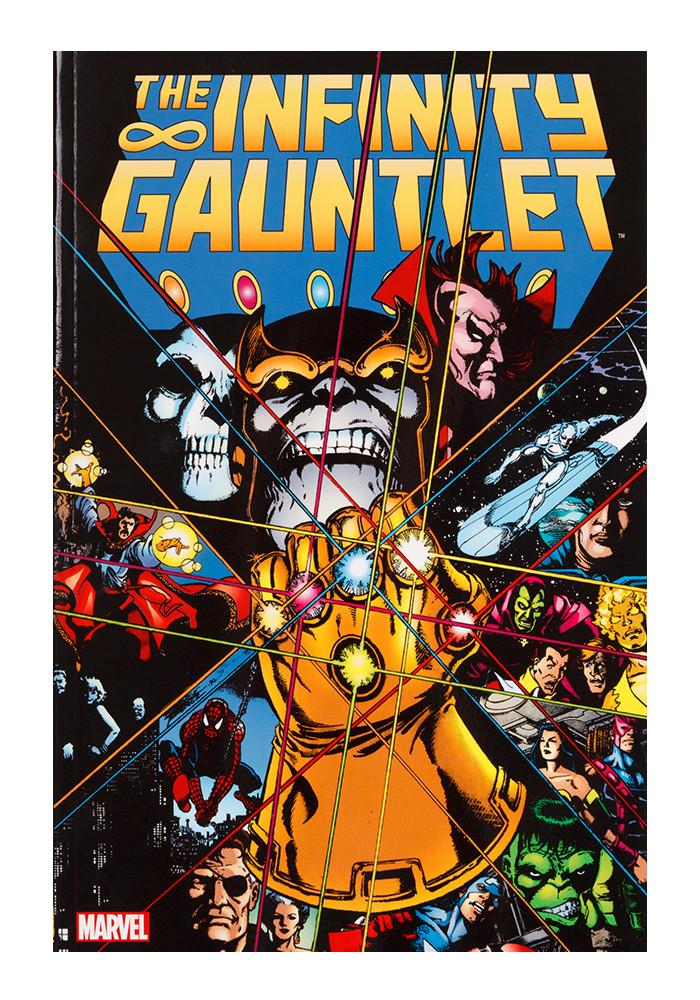

# ComicReader

<p align="center">
    
</p>

## How to make sure Java is installed
```console
foo@bar:~$ java -version
foo@bar:~$ javac -version
```
Both should return the version number, if not they will need to be installed.

## Execution
```console
foo@bar:~$ javac -cp "commons-logging-1.2.jar:junrar-0.7.jar:." *.java
foo@bar:~$ java -cp "commons-logging-1.2.jar:junrar-0.7.jar:." ComicReader
```

